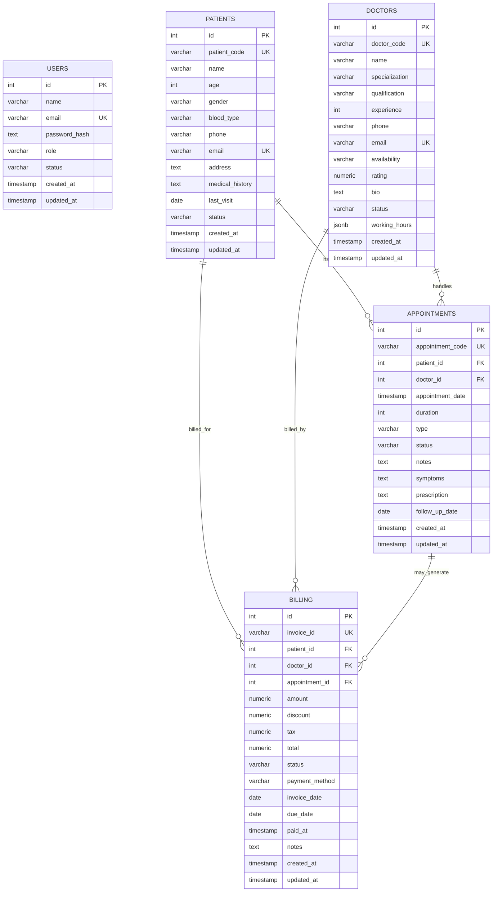

# PGAdmin Database Guide And ER Diagram

This is the pgAdmin-focused explanation of the PostgreSQL database used by this project.

Database:
- `medicare_hms`

Schema:
- `public`

Tables visible in pgAdmin:
- `users`
- `patients`
- `doctors`
- `appointments`
- `billing`

Not in pgAdmin:
- `notifications`
  - this is currently stored in memory only, not in PostgreSQL

## 1. How To Open It In pgAdmin

In pgAdmin4:

1. Open `Servers`
2. Open your PostgreSQL server
3. Open `Databases`
4. Open `medicare_hms`
5. Open `Schemas`
6. Open `public`
7. Open `Tables`

You will see:
- `users`
- `patients`
- `doctors`
- `appointments`
- `billing`

## 2. Visual ER Diagram

Use this Mermaid ER view as the simplest visual map:



## 3. Relationship Meaning In Simple English

### `users`
- Used for authentication only.
- This table does not directly connect to `patients`, `doctors`, `appointments`, or `billing`.
- It is used by:
  - login
  - register
  - auth me

### `patients`
- Parent table.
- One patient can have many appointments.
- One patient can have many billing records.

### `doctors`
- Parent table.
- One doctor can have many appointments.
- One doctor can have many billing records.

### `appointments`
- Child of `patients`
- Child of `doctors`
- Parent of `billing` in an optional way
- One appointment belongs to exactly one patient and one doctor.
- One appointment may have zero or many billing records linked to it.

### `billing`
- Child table.
- Each billing row belongs to:
  - one patient
  - one doctor
  - optionally one appointment

## 4. Table-By-Table pgAdmin View

## `users`

Purpose:
- login system
- register system
- authenticated profile lookup

Primary key:
- `id`

Unique keys:
- `email`

Important columns:
- `name`
- `email`
- `password_hash`
- `role`
- `status`
- `created_at`
- `updated_at`

Used by:
- frontend `/login`
- frontend `/register`
- backend `/api/v1/auth/login`
- backend `/api/v1/auth/register`
- backend `/api/v1/auth/me`

pgAdmin path:
- `medicare_hms -> Schemas -> public -> Tables -> users`

## `patients`

Purpose:
- stores all patient master records

Primary key:
- `id`

Business identifier:
- `patient_code`

Unique keys:
- `patient_code`
- `email`

Important columns:
- `patient_code`
- `name`
- `age`
- `gender`
- `blood_type`
- `phone`
- `email`
- `address`
- `medical_history`
- `last_visit`
- `status`

Referenced by:
- `appointments.patient_id`
- `billing.patient_id`

Delete behavior:
- if a patient is deleted, related appointments are deleted
- if a patient is deleted, related billing rows are deleted

Used by:
- frontend `/patients`
- frontend `/patients/:id`
- joined into `/appointments`
- joined into `/billing`

pgAdmin path:
- `medicare_hms -> Schemas -> public -> Tables -> patients`

## `doctors`

Purpose:
- stores doctor profiles and availability

Primary key:
- `id`

Business identifier:
- `doctor_code`

Unique keys:
- `doctor_code`
- `email`

Important columns:
- `doctor_code`
- `name`
- `specialization`
- `qualification`
- `experience`
- `phone`
- `email`
- `availability`
- `rating`
- `bio`
- `status`
- `working_hours`

Referenced by:
- `appointments.doctor_id`
- `billing.doctor_id`

Delete behavior:
- if a doctor is deleted, related appointments are deleted
- if a doctor is deleted, related billing rows are deleted

Used by:
- frontend `/doctors`
- joined into `/appointments`
- joined into `/billing`

pgAdmin path:
- `medicare_hms -> Schemas -> public -> Tables -> doctors`

## `appointments`

Purpose:
- stores appointment transactions between patients and doctors

Primary key:
- `id`

Business identifier:
- `appointment_code`

Foreign keys:
- `patient_id -> patients.id`
- `doctor_id -> doctors.id`

Important columns:
- `appointment_code`
- `patient_id`
- `doctor_id`
- `appointment_date`
- `duration`
- `type`
- `status`
- `notes`
- `symptoms`
- `prescription`
- `follow_up_date`

Referenced by:
- `billing.appointment_id`

Delete behavior:
- if the parent patient is deleted, appointment is deleted
- if the parent doctor is deleted, appointment is deleted
- if an appointment is deleted, `billing.appointment_id` becomes `NULL` because billing uses `ON DELETE SET NULL`

Used by:
- frontend `/appointments`
- dashboard recent appointments
- optional source for `/billing`

pgAdmin path:
- `medicare_hms -> Schemas -> public -> Tables -> appointments`

## `billing`

Purpose:
- stores invoices and payment tracking

Primary key:
- `id`

Business identifier:
- `invoice_id`

Foreign keys:
- `patient_id -> patients.id`
- `doctor_id -> doctors.id`
- `appointment_id -> appointments.id` optional

Important columns:
- `invoice_id`
- `patient_id`
- `doctor_id`
- `appointment_id`
- `amount`
- `discount`
- `tax`
- `total`
- `status`
- `payment_method`
- `invoice_date`
- `due_date`
- `paid_at`
- `notes`

Delete behavior:
- if patient is deleted, billing row is deleted
- if doctor is deleted, billing row is deleted
- if appointment is deleted, `appointment_id` becomes `NULL`

Used by:
- frontend `/billing`
- dashboard revenue summary

pgAdmin path:
- `medicare_hms -> Schemas -> public -> Tables -> billing`

## 5. Foreign Key Summary

This is the most important pgAdmin relationship summary:

### `appointments.patient_id -> patients.id`
- one patient
- many appointments

### `appointments.doctor_id -> doctors.id`
- one doctor
- many appointments

### `billing.patient_id -> patients.id`
- one patient
- many billing rows

### `billing.doctor_id -> doctors.id`
- one doctor
- many billing rows

### `billing.appointment_id -> appointments.id`
- one appointment
- zero or many billing rows
- nullable relationship

## 6. Best Way To Inspect In pgAdmin

For each table:

1. Right click table
2. Open `Properties`
3. Check:
   - `Columns`
   - `Constraints`
   - `Indexes`
   - `Foreign Keys`

Best places to inspect relationships:

- For parent-child overview:
  - open each table
  - check `Dependencies` and `Dependents`

- For keys:
  - open `Constraints`
  - inspect `Primary Key`, `Foreign Key`, and `Unique`

- For performance:
  - open `Indexes`

## 7. pgAdmin Query Examples

Use these in pgAdmin Query Tool.

### See all patients
```sql
SELECT * FROM patients ORDER BY patient_code;
```

### See all doctors
```sql
SELECT * FROM doctors ORDER BY doctor_code;
```

### See all appointments with names
```sql
SELECT
  a.appointment_code,
  p.patient_code,
  p.name AS patient_name,
  d.doctor_code,
  d.name AS doctor_name,
  a.appointment_date,
  a.type,
  a.status
FROM appointments a
JOIN patients p ON p.id = a.patient_id
JOIN doctors d ON d.id = a.doctor_id
ORDER BY a.appointment_date DESC;
```

### See all billing rows with names
```sql
SELECT
  b.invoice_id,
  p.patient_code,
  p.name AS patient_name,
  d.doctor_code,
  d.name AS doctor_name,
  a.appointment_code,
  b.amount,
  b.total,
  b.status,
  b.invoice_date
FROM billing b
JOIN patients p ON p.id = b.patient_id
JOIN doctors d ON d.id = b.doctor_id
LEFT JOIN appointments a ON a.id = b.appointment_id
ORDER BY b.invoice_date DESC, b.invoice_id;
```

### See counts by main table
```sql
SELECT 'users' AS table_name, COUNT(*) FROM users
UNION ALL
SELECT 'patients', COUNT(*) FROM patients
UNION ALL
SELECT 'doctors', COUNT(*) FROM doctors
UNION ALL
SELECT 'appointments', COUNT(*) FROM appointments
UNION ALL
SELECT 'billing', COUNT(*) FROM billing;
```

## 8. Frontend Page To Table Map

### Dashboard
- reads from:
  - `patients`
  - `doctors`
  - `appointments`
  - `billing`

### Patients page
- reads/writes:
  - `patients`

### Doctors page
- reads/writes:
  - `doctors`

### Appointments page
- reads/writes:
  - `appointments`
- also reads lookup values from:
  - `patients`
  - `doctors`

### Billing page
- reads/writes:
  - `billing`
- also reads lookup values from:
  - `patients`
  - `doctors`
  - `appointments`

### Login/Register
- reads/writes:
  - `users`

## 9. Simplest ER Understanding

If you want the shortest possible mental model:

- `users` = who can log in
- `patients` = patient master data
- `doctors` = doctor master data
- `appointments` = patient-doctor meeting records
- `billing` = invoice/payment records tied to patient, doctor, and optionally appointment

Core business chain:

```text
Patient -> Appointment <- Doctor
Patient -> Billing <- Doctor
Appointment -> Billing (optional)
```

## 10. Important Clarification

There is no direct foreign key from:
- `users` to `patients`
- `users` to `doctors`
- `users` to `appointments`
- `users` to `billing`

So in pgAdmin, `users` is separate from the hospital operational tables.
